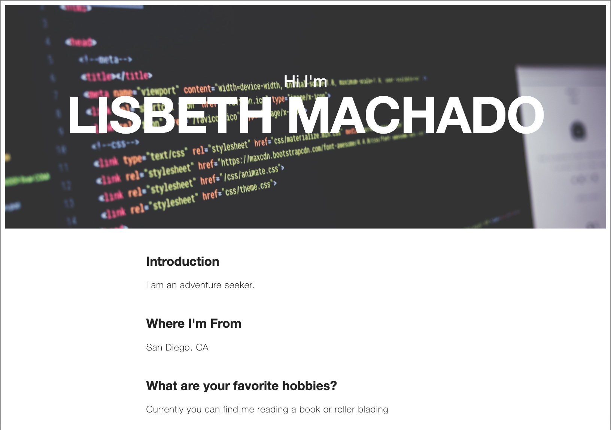
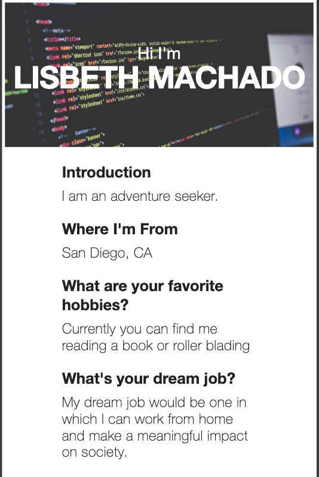

# About Me 

## Description
This is my first forked repository. This website is a static HTML website using semantic tags and minimal CSS. It is currently hosted on Github Pages. It's a simple, single paged website, detailing fun facts about me. It is also mobile responsive.

## Table of Contents    
* [Quick Start](#quick-start)
* [Installation](#Installation)
* [Usage](#usage)
* [Screenshots](#screenshots)
* [Technology](#technologies) 
* [Questions](#questions)  
* [License](#lisence)

## Quick Start
View the website hosted on Github pages by following the provided link to the live deployment.

[About-Me Live Deployment](https://lisbethmachado.github.io/about-me/)

## Installation
To install the application locally and edit the code, follow the steps below:
1. Fork the repository to your github account.
2. Clone the forked repository to the desired location using your terminal with the code "git clone <git@github.com:YOUR-USERNAME-HERE/about-me.git>"
3. Open the top level folder of the repository in your code editor.
4. Navigate to the 'index.html' file to make any desired edits.
5. Navigate to the 'css' folder to access the stylesheet and make any stylistic edits.
6. Once you're finished, open the 'index.html' file in your default browser and push any code versions you are satisfied with to publish.

*Follow Github instructions for Githup pages hosting*

## Usage
Use this template to become familiar with basic HTML and CSS structures and have a fun simple website to publish your interests and hobbies while you learn.
      
## Screenshots
### Web Application:

### Mobile Application:

## Technologies Used
* [GitHub](https://www.github.com/)

## Questions
### Lisbeth Machado
* :octocat: [GitHub: https://github.com/lisbethmachado](https://github.com/lisbethmachado)
* 📧 E-mail: lisbeth.webdev@gmail.com

For repository and more information visit [Github](http://www.github.com/lisbethmachado). You may contact us via [E-mail](mailto:lisbeth.webdev@gmail.com) with questions or suggestions. Thank you for your interest!

## License
<!-- Copyright 2020 - present Lisbeth Machado. -->
This project is licensed under the terms of the MIT license. 
More information is available at [opensource.org/licenses](https://opensource.org/licenses/MIT)